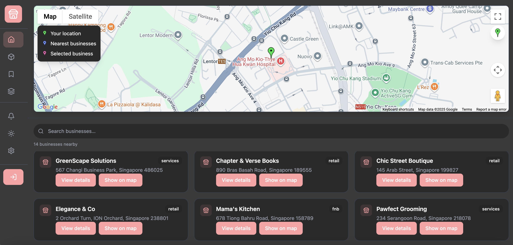
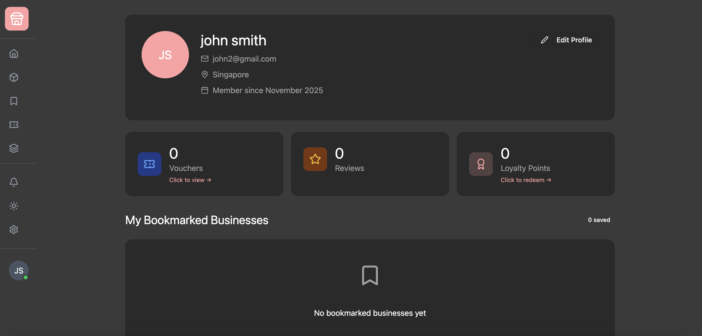
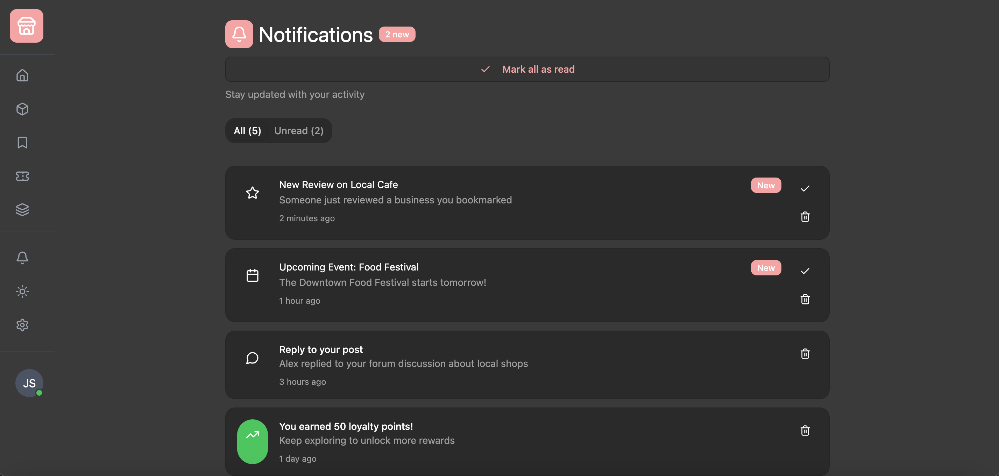
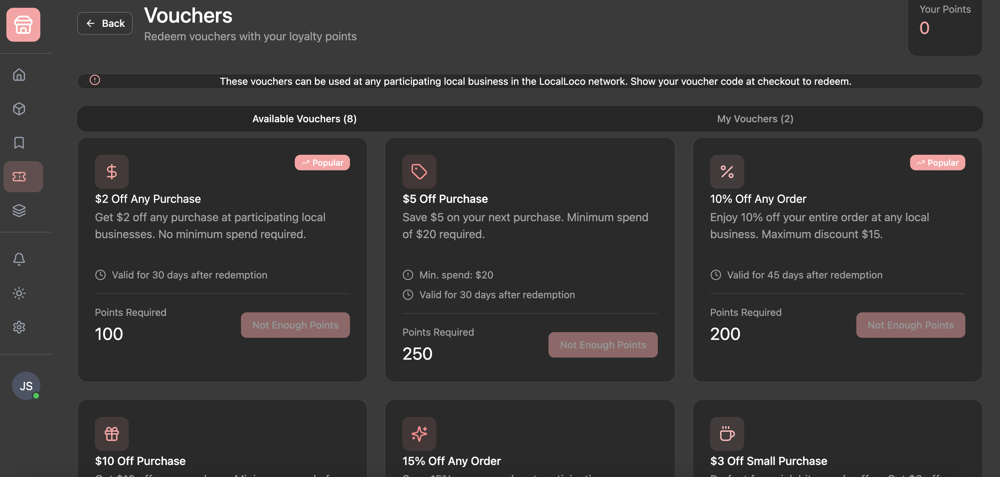

backend runs on **http://localhost:3000** while the frontend runs on **http://localhost:5173**

steps for usage:
1. after cloning the repo, run `npm install` to install all dependencies within the frontend and backend
2. after installing dependencies, start your WAMP/MAMP server to get MySQL running. 
3. run `npm run db:setup` to create all the needed tables
4. after table insertion, copy and paste the dummy data in `database/dummy.sql` into your mysql workbench and run the insertions
5. finally, run `npm run dev` to start both development servers

# 🏫 IS216 Web Application Development II

---

## Section & Group Number
G10 Group 3  

---

## Group Members

| Photo | Full Name | Role / Features Responsible For |
|:--:|:--|:--|
|  | Suan Loong | Frontend Developer - Landing map UI, sidebar, advanced search overlay |
|  | Jolene | Frontend Developer -   Business card & details components, explore page, bookmark UX, UI polish |
|  | Charles | Backend Developer - BE lead: data feed, filter logic/endpoints, local storage, build & deploy |
|  | Pamika Lim | UI/FE: assets & styles; Google mapsAPI/UI + distance/geolocate + forum, profile page, Onemaps API + postal code/address conversion  |
|  | Lin Hui | Backend Developer -  login & validation; UEN verification (stretch), link verification (stretch) |

> Place all headshot thumbnails in the `/photos` folder (JPEG or PNG).

---

## Business Problem

> Small local businesses struggle to maintain an online presence, limiting visibility to customers. Local shoppers also struggle to discover and trust nearby independent businesses because key information is scattered and inconsistent.
> Our web application provides a one-stop-for-all platform for shoppers to support and explore different local businesses, and for local entrepreneurs to reach more customers and grow their presence.

---

## Web Solution Overview

### 🎯 Intended Users
Primary - local shoppers looking for nearby local/independent shops/small businesses to support
Secondary - independent, local businesses that need discovery and have troubles reaching customers

### 💡 What Users Can Do & Benefits
Explain the core features and the benefit each provides.  

| Feature | Description | User Benefit |
|:--|:--|:--|

| **Interactive Map View (Google Maps API)** | Displays nearby local businesses as map pins, showing their distance from the user. Users can tap to view store details or get directions. | Enables effortless discovery of nearby shops and cafes, making it easy to explore and support local businesses.   |
| **Search & Filter Function**               | Allows users to search for specific businesses or filter by category (e.g., food, fashion, services, price).                                      | Saves time by helping users quickly find exactly what they’re looking for based on their interests.               |
| **Vendor Profiles / Storefronts**          | Each business has a dedicated page showing its description, photos, contact info, operating hours, and embedded map location.| Provides shoppers with essential information at a glance and helps businesses present their brand professionally. |
| **Announcements Section**                  | Displays the latest events, promotions, or new openings from local businesses. | Keeps users updated on current happenings and encourages them to visit or participate in local events.|
| **Reviews & Ratings**  | Users can rate and review businesses they’ve visited, and view feedback from others.| Builds trust and helps users make informed choices while giving businesses valuable feedback.|
| **Community Forum** | A space for users to discuss and share experiences or recommendations about local businesses.                                              | Fosters a sense of community and promotes engagement among local shoppers and merchants. |
| **Vendor Onboarding & Verification**| Businesses can sign up, verify their legitimacy (e.g., UEN), and manage multiple listings if they own more than one outlet.| Ensures authenticity of businesses and gives small vendors a reliable way to publicize themselves. |
**Referral & Rewards System**|
Each new user receives a unique referral code upon signup. When friends register using the code, both parties earn a $5 voucher. If a referral code is used more than five times, the reward increases to $10.|
Encourages user and platform growth through word-of-mouth while rewarding loyal users for promoting the platform.|
**Profile Page**|	Displays user details such as name, email, profile picture, reviews, loyalty points, and vouchers.|	Allows users to track their activity, manage their rewards, and personalize their experience.
**Edit Profile Overlay** |	Lets users update their personal details including name, email, location, and profile photo directly within the app. |	Empowers users to maintain accurate and personalized information with ease.
**Vendor Onboarding & Verification** |	Businesses can sign up, verify legitimacy (e.g., UEN), and manage multiple outlets. |	Ensures business authenticity and helps vendors effectively promote their stores.
**Link Verification** |	Automatically checks URLs uploaded by businesses to ensure they’re safe and not malicious. |Protects users from fraudulent or harmful links, improving trust and platform security.
| **Announcements Popup (Explore Tab)** | When users tap on the *Explore* tab, a popup highlights current announcements such as promotions, new store openings, or community events. | Instantly informs users about the latest local happenings without needing to search manually, encouraging timely visits and engagement. |

---

## Tech Stack

| Logo | Technology | Purpose / Usage |
|:--:|:--|:--|

|    🖥️   | **React.js + TypeScript** | Frontend framework for building a responsive, interactive UI with strong typing and reusable components.  |
|    🎨    | **Tailwind CSS**                        | Utility-first CSS framework for consistent, fast, and mobile-responsive styling.                                                                         |
|    ⚙️    | **Node.js + TypeScript** | Backend runtime and language used to handle API logic, authentication, and integrations. (Migrated from PHP for better scalability and maintainability.) |
|    🗄️   | **MySQL** | Relational database storing business listings, user accounts, bookmarks, and reviews.                                                                    | 
|    ☁️    | **GitHub + Azure**                      | Used for version control, continuous integration, and cloud deployment of the application.                                                               |
|    🗺️   | **Google Maps JavaScript API**          | Powers live maps, markers, and location-based discovery. Also used for geocoding (address → latitude/longitude) and directions display.                  |
|    📍    | **OneMap API (Singapore)**              | Converts postal codes into formatted addresses, which are then passed to Google Maps API for coordinate generation and storage in the database.          |
|    🔗    | **Google Safe Browsing API**            | Verifies URLs submitted by businesses to prevent unsafe or malicious links from being shared.                                                            |


> Add or remove technologies depending on your project stack (e.g., Express.js, Supabase, MongoDB Atlas, AWS S3).

---

## Use Case & User Journey

Provide screenshots and captions showing how users interact with your app.

1. **Landing Page**  
     
   - Displays the homepage with google maps navigation options.

2. **Search Feature**  
     
   - Users can browse and filter items by criteria.

3. **Profile Page**  
     
   - Shows user's details, vouchers, reviews, loyalty points and bookmarked businesses.
4. **Forum**  
     
   - Shows different users coming together to share their experiences about local businesses they have visited.
5. **Notifications**
  
   - Shows user related activity, new revies, upcoming events and points updates.
6. **Vouchers**
  
   - Shows user's points and list vouchers that the user can use their points to reedeem to use in stores.

---

## Developers Setup Guide

Comprehensive steps to help other developers or evaluators run and test your project.

---

### 0) Prerequisites
- [Git](https://git-scm.com/) v2.4+  
- [Node.js](https://nodejs.org/) v18+ and npm v9+  
- MySQL Workbench

---

### 1) Download the Project
```bash
git clone https://github.com/<org-or-user>/<repo-name>.git
cd <repo-name>
npm install
npm start
```

---

### 2) Configure Environment Variables
Create a `.env` file in the root directory with the following structure:

```bash
VITE_API_URL=<your_backend_or_firebase_url>
VITE_FIREBASE_API_KEY=<your_firebase_api_key>
VITE_FIREBASE_AUTH_DOMAIN=<your_auth_domain>
VITE_FIREBASE_PROJECT_ID=<your_project_id>
VITE_FIREBASE_STORAGE_BUCKET=<your_storage_bucket>
VITE_FIREBASE_MESSAGING_SENDER_ID=<your_sender_id>
VITE_FIREBASE_APP_ID=<your_app_id>
```

> Never commit the `.env` file to your repository.  
> Instead, include a `.env.example` file with placeholder values.

---

### 3) Backend / Cloud Service Setup

#### Firebase
1. Go to [Firebase Console](https://console.firebase.google.com/)
2. Create a new project.
3. Enable the following:
   - **Authentication** → Email/Password sign-in
   - **Firestore Database** or **Realtime Database**
   - **Hosting (optional)** if you plan to deploy your web app
4. Copy the Firebase configuration into your `.env` file.

#### Optional: Express.js / MongoDB
If your app includes a backend:
1. Create a `/server` folder for backend code.
2. Inside `/server`, create a `.env` file with:
   ```bash
   MONGO_URI=<your_mongodb_connection_string>
   JWT_SECRET=<your_jwt_secret_key>
   ```
3. Start the backend:
   ```bash
   cd server
   npm install
   npm start
   ```

---

### 4) Run the Frontend
To start the development server:
```bash
npm run dev
```
The project will run on [http://localhost:5173](http://localhost:5173) by default.

To build and preview the production version:
```bash
npm run build
npm run preview
```

---

### 5) Testing the Application

#### Manual Testing
Perform the following checks before submission:

| Area | Test Description | Expected Outcome |
|:--|:--|:--|
| Authentication | Register, Login, Logout | User successfully signs in/out |
| CRUD Operations | Add, Edit, Delete data | Database updates correctly |
| Responsiveness | Test on mobile & desktop | Layout adjusts without distortion |
| Navigation | All menu links functional | Pages route correctly |
| Error Handling | Invalid inputs or missing data | User-friendly error messages displayed |

#### Automated Testing (Optional)
If applicable:
```bash
npm run test
```

---

### 6) Common Issues & Fixes

| Issue | Cause | Fix |
|:--|:--|:--|
| `Module not found` | Missing dependencies | Run `npm install` again |
| `Firebase: permission-denied` | Firestore security rules not set | Check rules under Firestore → Rules |
| `CORS policy error` | Backend not allowing requests | Enable your domain in CORS settings |
| `.env` variables undefined | Missing `VITE_` prefix | Rename variables to start with `VITE_` |
| `npm run dev` fails | Node version mismatch | Check Node version (`node -v` ≥ 18) |

---

## Group Reflection

Each member should contribute 2–3 sentences on their learning and project experience.

> **Example Template:**  
> - *Alice:* Learned to build reusable Vue components and manage state effectively.  
> - *Ben:* Gained experience connecting frontend and backend APIs.  
> - *Chloe:* Improved UI/UX design workflow and collaboration using Figma.  
> - *David:* Understood how Firebase Authentication and Firestore integrate with modern SPAs.  
> - *Pamika:* Understood how Gmaps API and OneMaps API works, exploration of Figma, and reinforced knowledge on how to retrieve, convert and store coordinates in the database.
As a team, reflect on:
- Key takeaways from working with real-world frameworks  
- Challenges faced and how they were resolved  
- Insights on teamwork, project management, and problem-solving